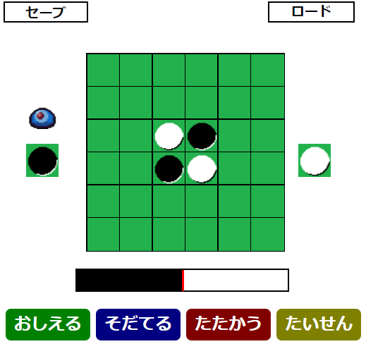

# Reversi

## 概要
強化学習チックな振る舞いを体感することを目的としたリバーシゲームです。  
MCTS（モンテカルロ木探索）ベースで学習し、自己探索だけでなく、人の手や別の学習済データとの対戦が可能です。

## プレイ方法
フォルダ内のindex.htmlをブラウザで実行することで、プレイできます。※chromeでのみ動作確認

## 機能
以下の機能があります。
- おしえる：プレイヤーが片方の色を操作します。対戦結果を教えてあげる必要があります。
- そだてる：自己学習します。アルゴリズムの挙動としては所謂MCTSを繰り返します。
- たたかう：用意されたモンスター達と戦いながら学習します。黃→青→赤の順で強いです。
- たいせん：学習結果出力で出力したファイルを対戦相手として、学習有/無の対戦を行います。
- セーブ：現在の学習結果を出力します。
- ロード：学習結果出力で出力したファイルをロードします。

## 注意事項
- 学習内容はすべてブラウザメモリ上で管理しています。ブラウザのページ更新(F5)等でメモリが破棄されると、学習内容を失います。
- 学習が深まる度にメモリを消費します。特にストッパー等は無いため、自動学習状態で放置するとページクラッシュの恐れがあります。
