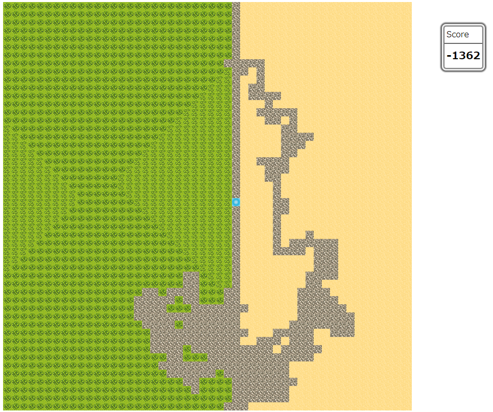

# TKM

## 問題文
ある惑星で不思議な植物を見つけたあなたは、サンプルとしてスペースコロニーに持ち帰りました。  
航行の途中、不意にいくつかの種が発芽してしまいコロニー内の栽培施設を覆い尽くす勢いで繁殖をはじめます。  
栽培施設内を駆け回り、植物の繁殖を食い止めてください。  
  
栽培施設は50×50のマス目で表されます。左から x 番目、上から y 番目のマスが (x,y) です。左上のマスが (1,1)、右上のマスが (50,1)、右下のマスが (50,50) です。  
マスは、以下の 3 種類で構成されています。  

- 土壌	：栽培に適したふかふかな土のマスです。植物が繁殖します。
- 畑	：不思議な植物が生えてしまったマスです。はじめは 1 本ですが、どんどん本数が増えていきます。
- 道路	：あなたが一度通ったマスです。土が踏み固められているため、植物は生えません。

不思議な植物について、 10 ターン毎に下記の通りに増殖します。

- 畑に生えた植物の本数が 1 本増殖します。
- 畑の上下左右の土壌を畑に変えます。その際の植物の本数は 1 本です。

あたなは、ターン毎に現在いるマスから上下左右に 1 マス移動することができます。  

- 移動先が土壌マスの場合、道路マスに変わります。
- 移動先が畑マスの場合、道路マスに変わり、生えている不思議な植物の本数分の駆除コストがかかります。

 900 ターンの間、栽培施設内を移動してできるだけ多くの土壌マスを残して下さい。

## 制約
N = 50  
入力は、各マスに対し、0.5 パーセント が畑（本数は 1本）、残りは土壌になるようにランダムで生成される。  
その後、マスの 1 つをランダムに選び道路マスに変え、あなたの現在地とする。

### 入力
N  
A1,1 A1,2 ... A1,N  
A2,1 A2,2 ... A2,N  
:  
AN,1 AN,2...  AN,N  
  
- 入力 Ay,x はマス (x,y) の初期状態を表し、.が土壌、#が畑、Wがあなたの現在地を表します

### 出力
毎ターンの移動を 900 行で出力して下さい。各移動は、下記のコマンドの通りです。
- U		：↑のマスに移動します。
- D		：↓のマスに移動します。
- R		：→のマスに移動します。
- L		：←のマスに移動します。
- その他：その場に留まります。

## スコア
[残った土壌マスの数 - かかった総駆除コスト] がスコアとなります。

## サンプル画像
  

