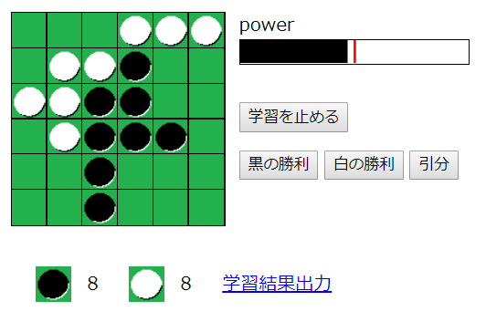

# Othello

## 概要
強化学習チックな振る舞いを体感することを目的としたオセロゲームです。  
MCTS（モンテカルロ木探索）ベースで学習し、自己探索だけでなく、人の手や別の学習済データとの対戦が可能です。

## プレイ方法
フォルダ内のindex.htmlをブラウザで実行することで、プレイできます。※chromeでのみ動作確認

## 機能
以下の機能があります。
- 自己学習：所謂MCTSを繰り返します。
- 黒で学習：プレイヤーが黒番で操作します。対戦結果を教えてあげる必要があります。
- 白で学習：プレイヤーが白番で操作します。対戦結果を教えてあげる必要があります。
- 学習結果ロード：学習結果出力で出力したファイルを読み込むことで、学習を再開できます。
- 練習（学習有）：学習結果出力で出力したファイルを対戦相手として、学習を行います。
- 対戦（学習無）：学習結果出力で出力したファイルを対戦相手として、対戦を行います。学習はしません。
- 学習結果出力：現在の学習結果を出力します。

## 注意事項
- 学習内容はすべてブラウザメモリ上で管理しています。ブラウザのページ更新等でメモリが破棄されると、学習内容を失います。
- 学習が深まる度にメモリを消費します。特にストッパー等は無いため、自動学習状態で放置するとページクラッシュの恐れがあります。
